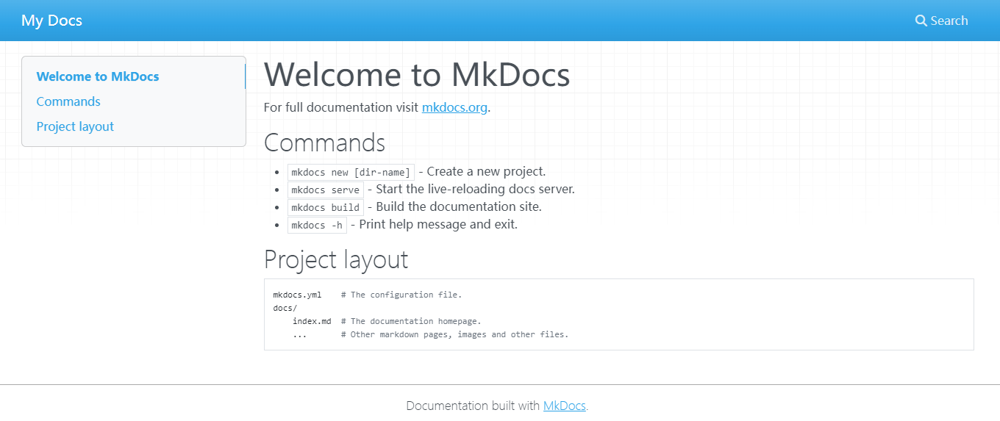
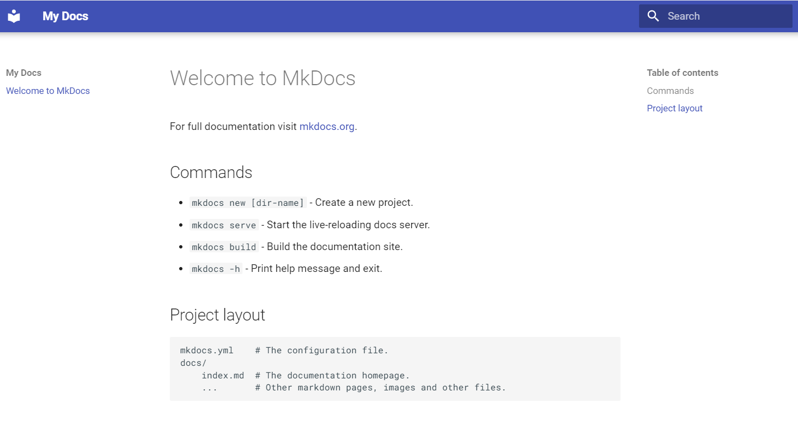

# MkDocs

## 简介

[MkDocs](https://www.mkdocs.org/) 是一个快速、简单且华丽的静态站点生成器，适用于构建项目文档。文档源文件是用 Markdown 编写的，并使用单个 YAML 配置文件进行配置。

## 安装MkDocs

我使用scoop管理我的软件：

```
scoop install python
pip install mkdocs
```

## 创建项目

```
cd ~/
mkdocs new docs
cd docs
```

## 本地build与测试

```
mkdocs serve -a localhost:7000
```

访问[http://127.0.0.1:7000/](http://127.0.0.1:7000/)



项目中可以忽略生成结果:
```
echo "site/" >> .gitignore
```

# Materail主题

本站选用[Material for MkDocs](https://squidfunk.github.io/mkdocs-material/)主题。

## 安装Material

```
pip install mkdocs-material
```

修改项目中的mkdocs.yml指定主题：

```
theme:
  name: material
```


